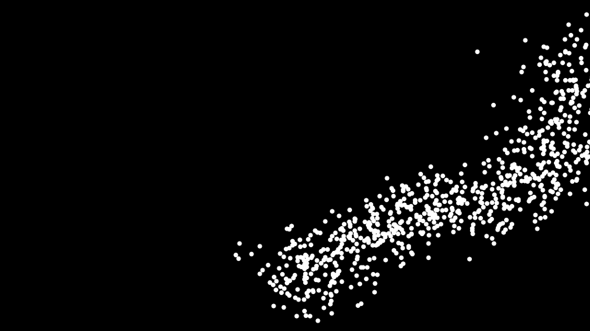
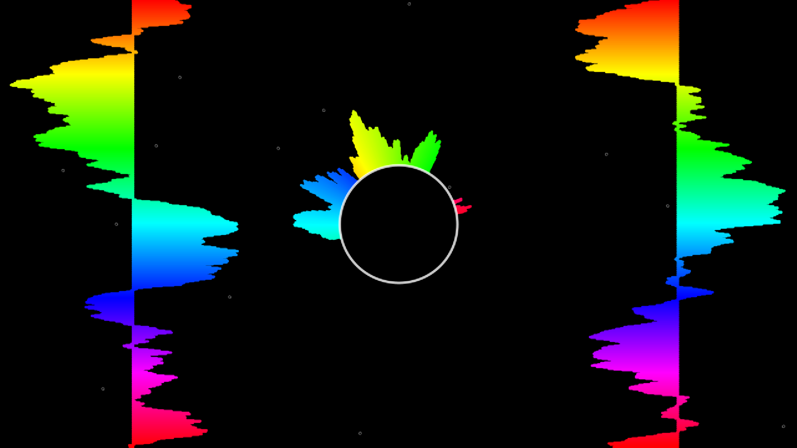
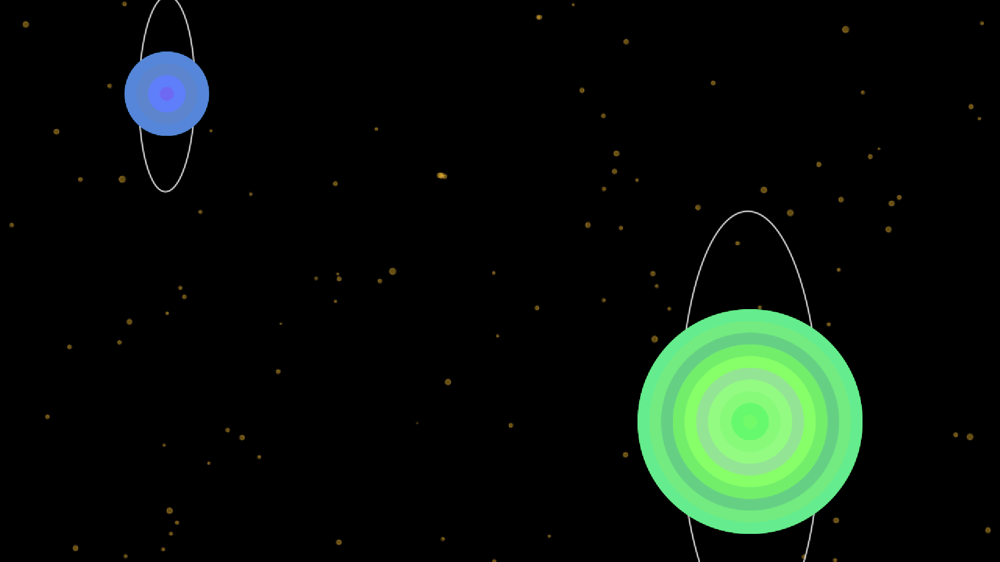

# Music Visualiser Project

# Group Members

| Student Name | Student Number |
|-----------|-----------|
|Stephanie Ifeoma Ogu | D22126511 |
|Nikka May Omo | C21359691 |
|Roxana Pohodnicaru | C21446942 |

# Visualisation Video

https://youtu.be/YO56n8Xqfyg

# Description of the Assignment
For our assignment, we chose the song "Flare" by Hensonn. From this song we got inspired to do a space theme visual basing it on the cover of their album.
We created six visuals that all react to the music. 
1. Stars and Cloud particles.
2. Earth inspired background with black circular rim. In addition, a bouncing ball mimicking the DVD screensaver. Lyrics appear "If you were a vegetable you'd be a cutecumber".
3. Bass ball with waveforms, commonly seen in music videos.
4. Boombox background that resembles a teleportation portal. With a colourful dynamic mountain range that grows in size. 
5. A bouncing ball that plays the piano.
6. Two flashing planets with rotating rings combined with a starry, fairy-like background. 

We built this project with the processing and minim libraries.

# Instructions

- For the controlling mechanism, we transition to another scene using the keyPressed logic with numeric cases ie 1 - 6.
- As previously mentioned, the lyrics appears in a sliding motion when key 'P' is pressed and it disappears with 'O' key.
- The space key is responsible for restarting the song.

# How it works

 We attempted to adhere to clean git repository norms. That is why we established the original master branch. That brach has only completed the assignment project. The product code was all on a development branch. We were making modifications in distinct branches, with one for each functionality component. There was also a branch [tracker](https://docs.google.com/spreadsheets/d/1Pr2AN-8XV4XSXAYneuDSKQsDpKSYxk0ziFuhoVzVUMI/edit?usp=sharing). 
 
 As a result, no one will pull non-working code to dev branch, so we never will face with the situation that our project was completely broken by accident. And we are ensured that dev branch only consists of modified code. We created pull requests for dev branch merging other branches' code to dev, and in the event of an issue, we addressed disagreements and performed code reviews jointly.

### Code section

Stephanie Ifeoma Ogu:

Nikka May Omo:

Roxana Pohodnicaru: CloudsBackground.java: My idea was to create a cluster of cloud particles that would randomly navigate across the screen. The way that this works is that the small white dots are rendered using the Gaussian distribution function. This means that instead of the dots randomly appearing anywhere on the screen, they will appear within the standard deviation of the mean position.

BassBall.java: This scene consists of a ball outlined in white. The size of the ball is increased based on the audio buffer. Behind it, there is a circular waveform. The waveform is made up of lines which are drawn from the centre of the screen outwards, depending on the audio buffer. The colour is set based on the index of the current element of the waveform array.

LeftBackgroundWaves.java + RightBackgroundWaves.java: Like the waveform mentioned in BassBall, the same idea applies here. There are 2 vertical waveforms on each side of the screen. These lines extend outwards on each side of the ‘middle line’ based on the audio buffer. Their colour are also set based on the index of the current element of the waveform array.

Planet.java: There are 2 planets in this scene. Each has a main large circle and a ring. The ring rotates around the planet at an angle that increases with each frame. The main circle of the planet contains an array of smaller circles continuously rendering within it. These smaller circles have varying shades of colour from the original colour of the large circle.

Fairies.java: My interpretation is that the small yellow circles are fairies or stars in space. Their size is based on the audio buffer. Their locations can be moved by the mouse. The circles are initialised to render at random coordinates across the screen. These fairies can move gently towards the mouse if the mouse is within a specific distance.

# What I am most proud of in the assignment

Stephanie Ifeoma Ogu: The component of this assignment that I am first have to say that we used our knowledge from classes about Java processing to get much more to make this amazing project.  During the work, I have learned a lot. I  was able to solidify our learning and apply my understanding of Java processing in real-world scenarios, and complete a large project.

And secondly, I proud of was the team teamwork. Despite having a busy semester, we were still able to collaborate well on this assignment. Setting deadlines and establishing separate channels of communication helped us to operate methodically and successfully. It was remarkable to witness how we helped one another, worked together to tackle challenging issues, and united our efforts. We used the different strengths that each member of our team possessed to get beyond mistakes and roadblocks. I improved my interpersonal abilities via this assignment, which will be helpful for future team initiatives. Overall, I am pleased with the work.

Nikka May Omo: This assignment has me achieve a significant progress in my learning journey for this module. I am most proud of the growth in terms of teamwork and learning more about how to visualise our creative ideas using processing. I was able to become productive and fulfill the deadline we set up thanks to our strict planning and frequent meetings. 

As a student who was worried at the start, I can confidently conclude I am satisfied with the work I contributed. I think the key achievement is that we were able to leverage each other's strengths and overcome any errors that arose during the project. This not only led to a successful outcome but also help me develop interpersonal skills that will serve me well in other future projects.

Roxana Pohodnicaru: 
This is the first big collaborative coding project I’ve worked and I can definitely say that I learned a lot from this experience. 
I encountered a  number of issues when I started this project because I had very little knowledge of Java or Processing. In overcoming these difficulties, I’ve become more confident and improved my coding skills. I discovered that the combination of Java and Processing is fun to experiment with.

I also enjoyed the collaborative aspect of this project. We were all open to share ideas and feedback with one another. The constructive criticism we gave each other helped us improve as programmers but also as individuals.

I feel happy with the way the project evolved.
