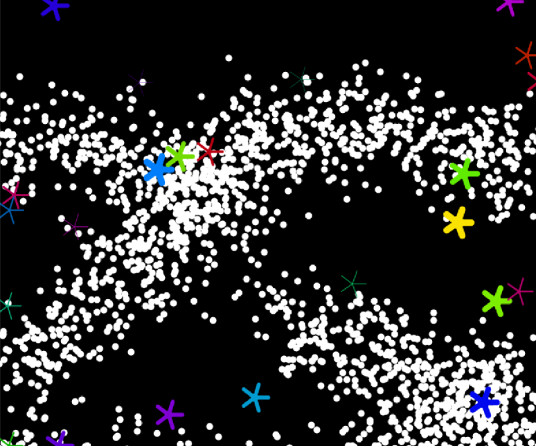
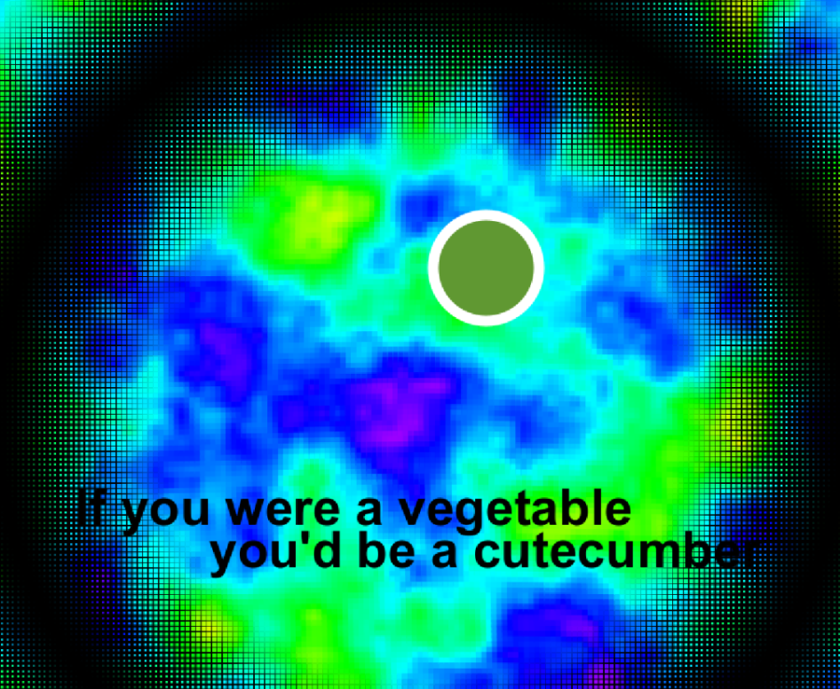
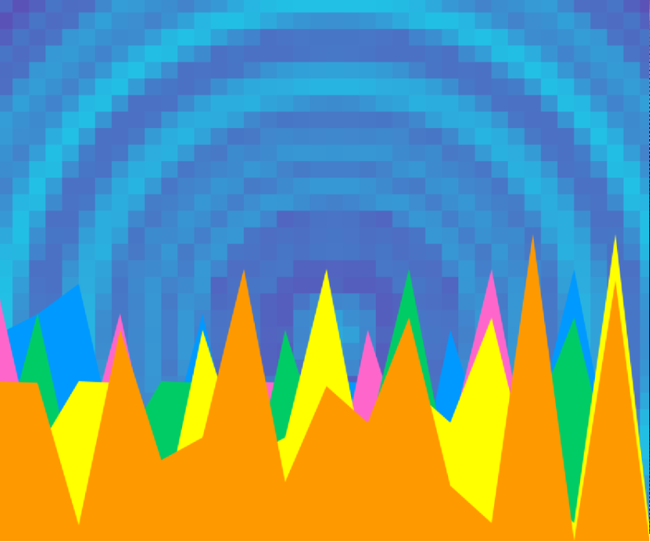

# Music Visualiser Project

# Group Members

| Student Name | Student Number |
|-----------|-----------|
|Stephanie Ifeoma Ogu | D22126511 |
|Nikka May Omo | C21359691 |
|Roxana Pohodnicaru | C21446942 |

# Visualisation Video

https://youtu.be/YO56n8Xqfyg

# List of Classes

|Classes|
|-----------|
|CloudsBackground.java|
|BassBall.java|
|LeftBackgroundWaves.java|
|RightBackgroundWaves.java|
|Planet.java|
|Fairies.java|
|Stars.java|
|Lyrics.java|
|ThirdDrop.java|
|BounceBall.java|
|MolecularsBC.java|
|SpeakersBC.java|
|Piano.java|
|CirclesBc.java|

# Description of the Assignment
For our assignment, we chose the song "Flare" by Hensonn. From this song we got inspired to do a space theme visual basing it on the cover of their album.
We created six visuals that all react to the music. 
1. Stars and Cloud particles.
2. Earth inspired background with black circular rim. In addition, a bouncing ball mimicking the DVD screensaver. Lyrics appear "If you were a vegetable you'd be a cutecumber".
3. Bass ball with waveforms, commonly seen in music videos.
4. Boombox background that resembles a teleportation portal. With a colourful dynamic mountain range that grows in size. 
5. A bouncing ball that plays the piano.
6. Two flashing planets with rotating rings combined with a starry, fairy-like background. 

We built this project with the processing and minim libraries.

# Instructions

- For the controlling mechanism, we transition to another scene using the keyPressed logic with numeric cases ie 1 - 6.
- As previously mentioned, the lyrics appears in a sliding motion when key 'P' is pressed and it disappears with 'O' key.
- The space key is responsible for restarting the song.

# How it works

 We attempted to adhere to clean git repository norms. That is why we established the original master branch. That brach has only completed the assignment project. The product code was all on a development branch. We were making modifications in distinct branches, with one for each functionality component. There was also a branch [tracker](https://docs.google.com/spreadsheets/d/1Pr2AN-8XV4XSXAYneuDSKQsDpKSYxk0ziFuhoVzVUMI/edit?usp=sharing). 
 
 As a result, no one will pull non-working code to dev branch, so we never will face with the situation that our project was completely broken by accident. And we are ensured that dev branch only consists of modified code. We created pull requests for dev branch merging other branches' code to dev, and in the event of an issue, we addressed disagreements and performed code reviews jointly.

### Code section

Stephanie Ifeoma Ogu:

BounceBall.java: This file draws a ball that bounces against the window's edges as it moves randomly across the screen. Every time, the color of the ball changes at random. Its speed is connected to the music amplitude. It appear first in a random place of screen and have a random speed form in range of -1 to 1, random angle of direction, random colour. The color of the ball is set in the HSB color mode using the fill() function in the render() method. The ball's speed is then governed by the amplitude of the music, which is read using the getAmplitude() function. Following that, the ball moves across the screen at the specified speeds and angles. 

MolecularsBC.java: This file contains a class for creating graphics-based animations. The constructor generates a new 'PGraphics' graphics object with the same size as the application window. The'render()' function iterates over each place in the application window and creates several rectangles using stacked loops. The size of each rectangle is defined by the distance between its location and the center of the window, and the color is determined by noise values produced with the 'noise()' function. For this The distance variable is calculated by 'dist()' function, which simply computes the distance between two locations in two-dimensional space. Thus, the farther from the center of the screen the point is, the smaller the size of the molecule. This creates a gradient effect where the molecules in the center of the screen are larger and brighter, while those at the periphery are smaller and faded. On the screen we see on the 'pg' graphics object with this planet/molecular background.

SpeakersBC.java: This code draws animated graphic elements on the background of the screen. The `ballX` and `ballY` variables are responsible for the coordinates of the center of the circles that will be drawn in each iteration of the loop. The original idea was to make a red background for the hole, but it looked more like a speaker. But after the purpose of this class changed to the background of the sky, which became the sky for the mountains of a suitable blue color.

The main logic happens in the `for` loop. It is used to display squares in a grid. Two nested loops go through all the squares on the screen, and for each square, the distance from the center of the screen to the center of the square is calculated. The noise value is then calculated using `mv.noise()`. This value is used to set the transparency of the square, which creates an animation effect.

In each iteration of the `for` loop, the `mv.fill()` method is called to set the fill color, `mv.rect()` to draw a square on the screen. The squares are drawn based on the value of the loop counter `i` and `j` multiplied by the size of the square `squareSize`.
This code draws animated graphic elements on the background of the screen.

The loop runs from zero to the length of the AudioBuffer. The AudioBuffer element is responsible for the x-axis. Next, the nested loop calculates the distance to the y-axis, going through 50 times (this number does not affect anything). The coordinates of each square are calculated and a random noise value is generated based on the distance and the current frame. alphaValue is responsible for the degree of transparency.

Piano.java: My favorite class is piano. It is quite simple to perform. Drawn using piano rectangles. From the amplitude values, the amplitude range is calculated and a specific frequency is assigned to each key. When the frequency of the song coincides with the frequency of the key, it is visually "pressed" - it changes color and slightly moves forward. In the first version of the piano, RGB colors were used - and the tiles changed color (a screenshot is given), but we decided to use HSB later, because it was more suitable for the colors of the rest of the project. It also draws a ball, whose position is calculated in the same way as the frequency range of the piano tiles.

CirclesBc.java: This code generates the appearance of oscillating lines in the shape of circular waves on a black screen. The backdrop color is first set to black. It generates an array of soundforms before determining the color and thickness of the lines. It computes the number of lines to be created as well as the width of each line to fit the complete width of the screen. The X and Y coordinates of the line are then determined for each member in the soundform array. For each line, an offset value is produced using the noise function "noise" and the time variable "t". A vertical line is produced using the computed coordinates and offset value for each line. 
The time variable "t" is raised by 0.1, resulting in smooth frame shifts and a motion effect.

Nikka May Omo:

Stars.java: This file is responsible for the creation of the stars in a dynamic way. Instead of the colour being defined by common RGB values it depends on the hue, saturation and brightness values. I implemented it to have a random hue for the stars to look unique. The heavier the star, the more it brightens up.The star weight and coordinates x and y are generated randomly with the method ‘random’. The calculated star speed is what allows the x and y coordinates to be changed randomly. 

The method stroke determines the colour of the lines that form the star shape. In order to form the star shape, I simply wanted to do it with lines. I utilised a for loop in order to create five lines that start from the centre and it radiates outwards. In order to fully capture the visual of a star I purposely included a circle at the centre of it to make the visual look fuller.My idea was to showcase stars depending on the amplitude. The amount of stars is created with the map method and it is supported by the rounded amplitude taken which is put into numStars. After determining numStars, this is used in a for loop functions for specified number of stars to keep generating. In conclusion, each star will be assigned a random color and its number and movement is dependent on the amplitude of the song. 

Lyrics.java:

At first, I had PoliceText.java implemented for the lyrics which showcases a series of police tapes moving the opposite direction of each other with the yellow tape moving along. After combining the boombox background, we decided that a simple design is more suitable. The lyrics are “If you were a vegetable, you’d be a cutecumber”. Instead of having the text together I separated them as lyricLeft and lyricRight. it would be more visually pleasing to include more dynamics. Keeping that in mind, lyricLeft is sliding from the left and lyricRight text is sliding from the opposite direction. It is the same idea as PoliceText.java but it is more of a classic design. Using the ‘keyPressed’, the lyrics come into sight, sliding to the centre when key ‘P’ is pressed. With the ‘O’ key, it disappears. In terms of its code, it consists of two methods, update() and render(). I made use of pushStyle in order to store the style. As you can see from the image, the text is set to black for it to stand out and contrast with the background and the moving ball. The previous style setting is brought back with the use of popStyle().

ThirdDrop.java

This is a visualisation of colourful mountain ranges that dynamically move up and down to the amplitude of the music. The different mountains are stacked on top of each other vertically. The first mountain is blue, with a pink mountain arranged on top followed by a green mountain, additionally a yellow mountain and the final mountain is orange. As the colours of the other visuals so far have been rainbow themed, I picked the colours to match it. These colours are in an array “mountainColours” and it is represented in hexadecimal notation for the reason being that using other ways caused conflicts with the code. 

The flowy feature mimicking the shape of the mountains is the result of Perlin noise, the values between 1 and 0, which are produced randomly, are part of it. These are then put into the mapping of the y and x positions to allow the visual to be natural looking. The speed of the mountain is conditioned based on the amplitude which affects the y coordinate of all the vertices. I multiplied it by 200 to allow the mountain to be dynamically moving and project more with amplitude being the main reason. Each mountain is unique as the t variable is increased by 0.01.This mountainous range perfectly fits our overall scenes and matches the boombox teleportation background.

Roxana Pohodnicaru: CloudsBackground.java: My idea was to create a cluster of cloud particles that would randomly navigate across the screen. The way that this works is that the small white dots are rendered using the Gaussian distribution function. This means that instead of the dots randomly appearing anywhere on the screen, they will appear within the standard deviation of the mean position.

BassBall.java: This scene consists of a ball outlined in white. The size of the ball is increased based on the audio buffer. Behind it, there is a circular waveform. The waveform is made up of lines which are drawn from the centre of the screen outwards, depending on the audio buffer. The colour is set based on the index of the current element of the waveform array.

LeftBackgroundWaves.java + RightBackgroundWaves.java: Like the waveform mentioned in BassBall, the same idea applies here. There are 2 vertical waveforms on each side of the screen. These lines extend outwards on each side of the ‘middle line’ based on the audio buffer. Their colour are also set based on the index of the current element of the waveform array.

Planet.java: There are 2 planets in this scene. Each has a main large circle and a ring. The ring rotates around the planet at an angle that increases with each frame. The main circle of the planet contains an array of smaller circles continuously rendering within it. These smaller circles have varying shades of colour from the original colour of the large circle.

Fairies.java: My interpretation is that the small yellow circles are fairies or stars in space. Their size is based on the audio buffer. Their locations can be moved by the mouse. The circles are initialised to render at random coordinates across the screen. These fairies can move gently towards the mouse if the mouse is within a specific distance.

# What I am most proud of in the assignment

Stephanie Ifeoma Ogu: The component of this assignment that I am first have to say that we used our knowledge from classes about Java processing to get much more to make this amazing project.  During the work, I have learned a lot. I  was able to solidify our learning and apply my understanding of Java processing in real-world scenarios, and complete a large project.

And secondly, I proud of was the team teamwork. Despite having a busy semester, we were still able to collaborate well on this assignment. Setting deadlines and establishing separate channels of communication helped us to operate methodically and successfully. It was remarkable to witness how we helped one another, worked together to tackle challenging issues, and united our efforts. We used the different strengths that each member of our team possessed to get beyond mistakes and roadblocks. I improved my interpersonal abilities via this assignment, which will be helpful for future team initiatives. Overall, I am pleased with the work.

I'd want to highlight Piano and SpeakersBC from what I've written.

In the Piano lesson, I created a gorgeous and interactive piano interface using several Processing features. To create an app that plays musical notes and allows you to play the virtual piano, I used my experience of visuals, animations, multi-touch input, and sound effects. I'm delighted to have produced a useful and visually appealing software for making music and learning to play the piano.

I utilized my experience of working with graphic components and sound input in the SpeakersBC class to construct a backdrop animation that responds to sound. I utilized the audio input to analyze the audio stream and build visual components that move and change color as the music played. I am delighted to have made a beautiful and effective animation that may be used as a background for a music video or concert.

In both situations, I'm glad to have utilized my knowledge and abilities to build something helpful and attractive that others may use to educate and delight themselves.

Nikka May Omo: This assignment has me achieve a significant progress in my learning journey for this module. I am most proud of the growth in terms of teamwork and learning more about how to visualise our creative ideas using processing. I was able to become productive and fulfill the deadline we set up thanks to our strict planning and frequent meetings. 

As a student who was worried at the start, I can confidently conclude I am satisfied with the work I contributed. I think the key achievement is that we were able to leverage each other's strengths and overcome any errors that arose during the project. This not only led to a successful outcome but also help me develop interpersonal skills that will serve me well in other future projects. Comparing all the visuals, I was responsible for, I appreciate the stars the mountains the most as it looks the more visually appealing and i learned more considering it took me a lot of errors and trials for it work perfectly.

Roxana Pohodnicaru: 
This is the first big collaborative coding project I’ve worked and I can definitely say that I learned a lot from this experience. 
I encountered a  number of issues when I started this project because I had very little knowledge of Java or Processing. In overcoming these difficulties, I’ve become more confident and improved my coding skills. I discovered that the combination of Java and Processing is fun to experiment with.

I also enjoyed the collaborative aspect of this project. We were all open to share ideas and feedback with one another. The constructive criticism we gave each other helped us improve as programmers but also as individuals.

I feel happy with the way the project evolved.
